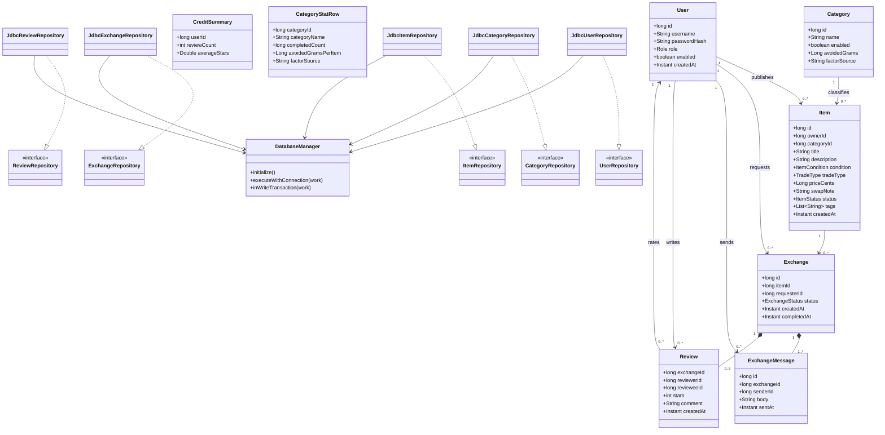
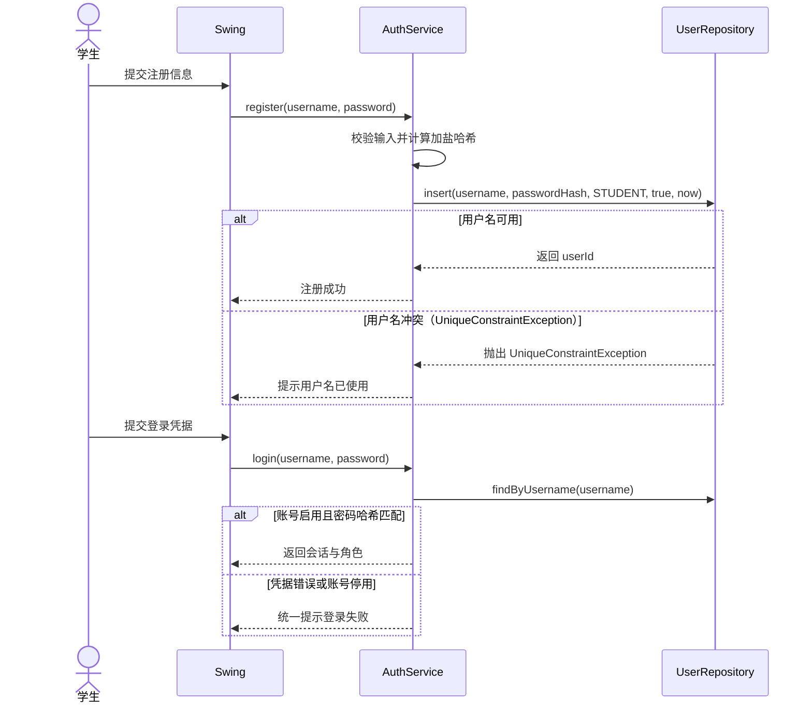
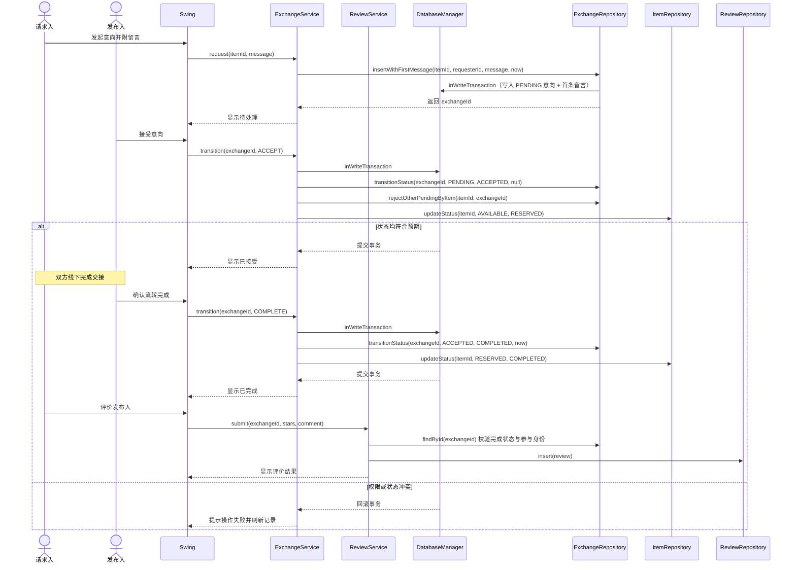
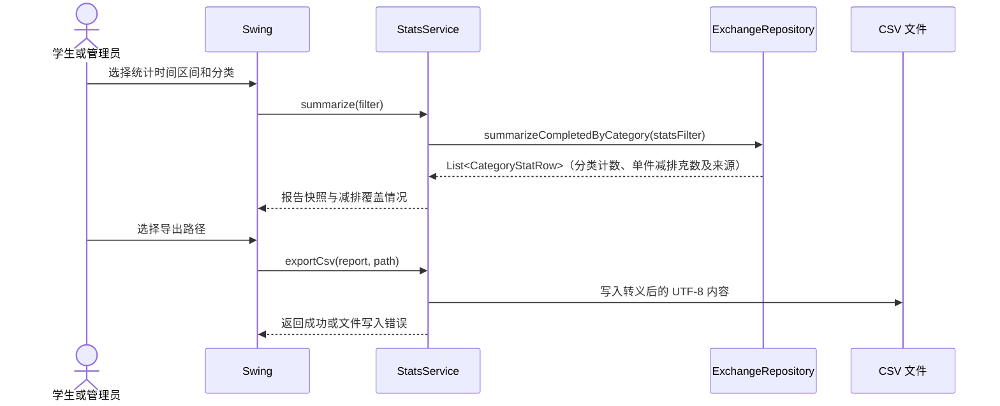

# UML 类图与时序图

以下类图与时序图与当前已落地的 `domain`、`repository` 代码及规划中的 `service`、`ui` 层保持一致。业务规则与事务约定见[需求规格](requirements.md)和[架构设计](architecture.md)。

## 领域类与模块关系

```mermaid
classDiagram
    class User {
        +long id
        +String username
        +String passwordHash
        +Role role
        +boolean enabled
        +Instant createdAt
    }
    class Category {
        +long id
        +String name
        +boolean enabled
        +Long avoidedGrams
        +String factorSource
    }
    class Item {
        +long id
        +long ownerId
        +long categoryId
        +String title
        +String description
        +ItemCondition condition
        +TradeType tradeType
        +Long priceCents
        +String swapNote
        +ItemStatus status
        +List~String~ tags
        +Instant createdAt
    }
    class Exchange {
        +long id
        +long itemId
        +long requesterId
        +ExchangeStatus status
        +Instant createdAt
        +Instant completedAt
    }
    class ExchangeMessage {
        +long id
        +long exchangeId
        +long senderId
        +String body
        +Instant sentAt
    }
    class Review {
        +long exchangeId
        +long reviewerId
        +long revieweeId
        +int stars
        +String comment
        +Instant createdAt
    }
    class CreditSummary {
        +long userId
        +int reviewCount
        +Double averageStars
    }
    class CategoryStatRow {
        +long categoryId
        +String categoryName
        +long completedCount
        +Long avoidedGramsPerItem
        +String factorSource
    }

    User "1" --> "0..*" Item : publishes
    Category "1" --> "0..*" Item : classifies
    Item "1" --> "0..*" Exchange
    User "1" --> "0..*" Exchange : requests
    Exchange "1" *-- "1..*" ExchangeMessage
    User "1" --> "0..*" ExchangeMessage : sends
    Exchange "1" *-- "0..2" Review
    User "1" --> "0..*" Review : writes
    Review "0..*" --> "1" User : rates

    class DatabaseManager {
        +initialize()
        +executeWithConnection(work)
        +inWriteTransaction(work)
    }
    class UserRepository {
        <<interface>>
    }
    class CategoryRepository {
        <<interface>>
    }
    class ItemRepository {
        <<interface>>
    }
    class ExchangeRepository {
        <<interface>>
    }
    class ReviewRepository {
        <<interface>>
    }
    class JdbcUserRepository
    class JdbcCategoryRepository
    class JdbcItemRepository
    class JdbcExchangeRepository
    class JdbcReviewRepository

    JdbcUserRepository ..|> UserRepository
    JdbcCategoryRepository ..|> CategoryRepository
    JdbcItemRepository ..|> ItemRepository
    JdbcExchangeRepository ..|> ExchangeRepository
    JdbcReviewRepository ..|> ReviewRepository
    JdbcUserRepository --> DatabaseManager
    JdbcCategoryRepository --> DatabaseManager
    JdbcItemRepository --> DatabaseManager
    JdbcExchangeRepository --> DatabaseManager
    JdbcReviewRepository --> DatabaseManager
```

## 注册和登录

```mermaid
sequenceDiagram
    actor Student as 学生
    participant UI as Swing
    participant Auth as AuthService
    participant UserRepo as UserRepository
    Student->>UI: 提交注册信息
    UI->>Auth: register(username, password)
    Auth->>Auth: 校验输入并计算加盐哈希
    Auth->>UserRepo: insert(username, passwordHash, STUDENT, true, now)
    alt 用户名可用
        UserRepo-->>Auth: 返回 userId
        Auth-->>UI: 注册成功
    else 用户名冲突（UniqueConstraintException）
        UserRepo-->>Auth: 抛出 UniqueConstraintException
        Auth-->>UI: 提示用户名已使用
    end
    Student->>UI: 提交登录凭据
    UI->>Auth: login(username, password)
    Auth->>UserRepo: findByUsername(username)
    alt 账号启用且密码哈希匹配
        Auth-->>UI: 返回会话与角色
    else 凭据错误或账号停用
        Auth-->>UI: 统一提示登录失败
    end
```

## 意向到互评

```mermaid
sequenceDiagram
    actor Buyer as 请求人
    actor Owner as 发布人
    participant UI as Swing
    participant Trade as ExchangeService
    participant Rate as ReviewService
    participant DB as DatabaseManager
    participant ExRepo as ExchangeRepository
    participant ItemRepo as ItemRepository
    participant RevRepo as ReviewRepository

    Buyer->>UI: 发起意向并附留言
    UI->>Trade: request(itemId, message)
    Trade->>ExRepo: insertWithFirstMessage(itemId, requesterId, message, now)
    ExRepo->>DB: inWriteTransaction（写入 PENDING 意向 + 首条留言）
    ExRepo-->>Trade: 返回 exchangeId
    Trade-->>UI: 显示待处理

    Owner->>UI: 接受意向
    UI->>Trade: transition(exchangeId, ACCEPT)
    Trade->>DB: inWriteTransaction
    Trade->>ExRepo: transitionStatus(exchangeId, PENDING, ACCEPTED, null)
    Trade->>ExRepo: rejectOtherPendingByItem(itemId, exchangeId)
    Trade->>ItemRepo: updateStatus(itemId, AVAILABLE, RESERVED)
    alt 状态均符合预期
        DB-->>Trade: 提交事务
        Trade-->>UI: 显示已接受
        Note over Buyer,Owner: 双方线下完成交接
        Owner->>UI: 确认流转完成
        UI->>Trade: transition(exchangeId, COMPLETE)
        Trade->>DB: inWriteTransaction
        Trade->>ExRepo: transitionStatus(exchangeId, ACCEPTED, COMPLETED, now)
        Trade->>ItemRepo: updateStatus(itemId, RESERVED, COMPLETED)
        DB-->>Trade: 提交事务
        Trade-->>UI: 显示已完成
        Buyer->>UI: 评价发布人
        UI->>Rate: submit(exchangeId, stars, comment)
        Rate->>ExRepo: findById(exchangeId) 校验完成状态与参与身份
        Rate->>RevRepo: insert(review)
        Rate-->>UI: 显示评价结果
    else 权限或状态冲突
        DB-->>Trade: 回滚事务
        Trade-->>UI: 提示操作失败并刷新记录
    end
```

## 统计和导出

```mermaid
sequenceDiagram
    actor User as 学生或管理员
    participant UI as Swing
    participant Stats as StatsService
    participant ExRepo as ExchangeRepository
    participant CSV as CSV 文件
    User->>UI: 选择统计时间区间和分类
    UI->>Stats: summarize(filter)
    Stats->>ExRepo: summarizeCompletedByCategory(statsFilter)
    ExRepo-->>Stats: List<CategoryStatRow>（分类计数、单件减排克数及来源）
    Stats-->>UI: 报告快照与减排覆盖情况
    User->>UI: 选择导出路径
    UI->>Stats: exportCsv(report, path)
    Stats->>CSV: 写入转义后的 UTF-8 内容
    Stats-->>UI: 返回成功或文件写入错误
```
